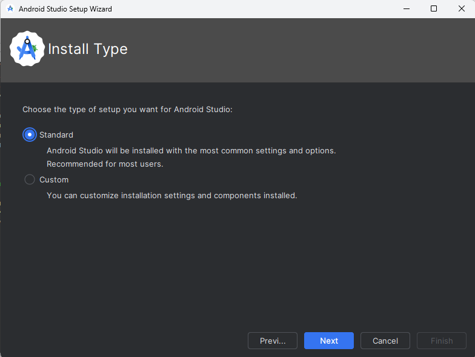
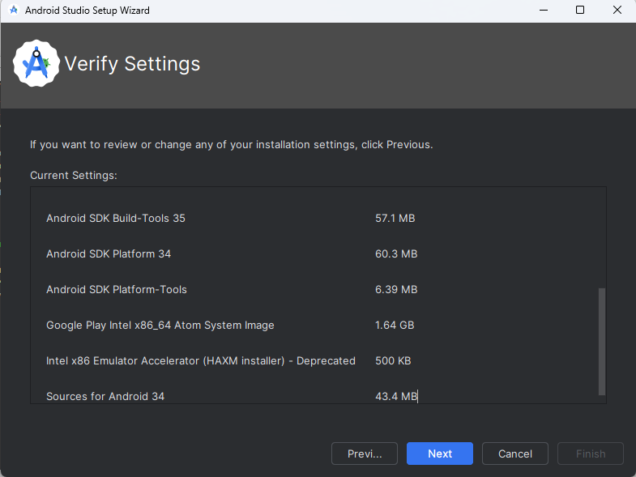
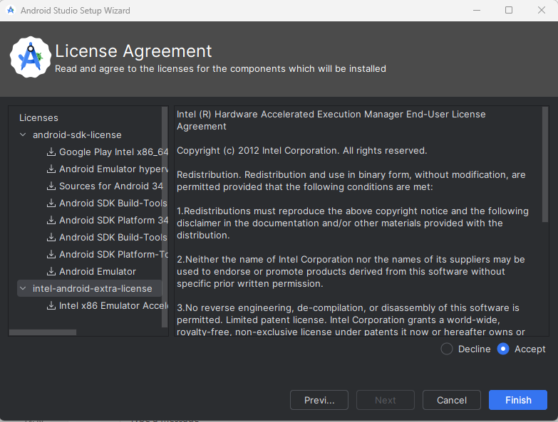

# 📱 A Simple Mobile App

A simple mobile app using React Native expo framework

## 📋 Table of Contents

- [Install Chocolatey](#-install-chocolatey)
- [Dependencies Installation](#-dependencies-installation)
- [Android Studio Setup](#-android-studio-setup)
- [Expo Setup](#-expo-setup)
- [Project Creation](#-project-creation)
- [Running Your App](#-running-your-app)
- [Development Tips](#-development-tips)
- [Troubleshooting](#-troubleshooting)

## 🍫 Install Chocolatey

### 1. Open PowerShell as Administrator 👨‍💻

- Press `Win + X`
- Select "Windows PowerShell (Admin)" or "Terminal (Admin)"

### 2. Install Chocolatey 📦

```powershell
Set-ExecutionPolicy Bypass -Scope Process -Force; [System.Net.ServicePointManager]::SecurityProtocol = [System.Net.ServicePointManager]::SecurityProtocol -bor 3072; iex ((New-Object System.Net.WebClient).DownloadString('https://community.chocolatey.org/install.ps1'))
```

### 3. Verify Installation ✅

```powershell
choco --version
```

## 🛠 Dependencies Installation

### 1. Install Required Software

```powershell
# Install essential development tools
choco install nodejs-lts -y     # ⚡ Node.js LTS
choco install openjdk17 -y      # ☕ Java Development Kit
choco install androidstudio -y  # 🤖 Android Studio
choco install vscode -y         # 📝 Visual Studio Code
choco install git -y           # 🌿 Git

# Refresh environment variables
refreshenv

# Verify installations
node --version
npm --version
git --version
code --version
java --version
```

## 🤖 Android Studio Setup

### 1. Initial Configuration

1. Launch Android Studio
2. Select Install type
	- Standard (Recommended) - [Standard Setup](#standard-setup-)
	- Custom - [Install SDK Components](#2-install-sdk-components-)
3. Go to Settings/Preferences → Appearance & Behavior → System Settings → Android SDK

##  Standard Setup 📱




### 2. Install SDK Components 📱

In "SDK Platforms" tab, install anroid 14 or 15 and their api's:

- ✅ Android 14.0 (API 34)
- ✅ Android SDK Platform 34
- ✅ Intel x86 Atom_64 System Image
- ✅ Google APIs Intel x86 Atom System Image

In "SDK Tools" tab, install:

- ✅ Android SDK Build-Tools 34
- ✅ Android SDK Command-line Tools
- ✅ Android Emulator
- ✅ Android SDK Platform-Tools

### 3. Create Android Virtual Device (AVD) 📱

## 📱 Expo Setup

### 1. Create Expo Account (Optional but Recommended)

```powershell
# Login to Expo
npx expo login

# Or create account if you don't have one
npx expo register
```

## 🎯 Project Creation

### 1. Create New Expo Project

```powershell
# Create new project
npx create-expo-app ExpoSimpleMobileApp
cd ExpoSimpleMobileApp

# Open in VSCode
code .
```

## ▶️ Running Your App

### 1. Set environment variables

#### Set ANDROID_HOME 🏠

```powershell
[System.Environment]::SetEnvironmentVariable('ANDROID_HOME', '$env:LOCALAPPDATA\Android\Sdk', 'User')
```

#### Add platform-tools to Path 🛠

```powershell
[System.Environment]::SetEnvironmentVariable('Path', $env:Path + ';$env:LOCALAPPDATA\Android\Sdk\platform-tools', 'User')
```
> [!NOTE]  
> Check and verify **$env:LOCALAPPDATA** is updated with your local path. If not, find the acutal path of sdk and platform-tools and update accordingly

### 2. Start Development Server

```powershell
# Start Expo development server
npx expo start
```

### 3. Running on Android Emulator 📱

```powershell
# Start Android emulator first
npx expo start --android
```

### 4. Running on Physical Device 📱

1. Install "Expo Go" app from Play Store/App Store
2. Scan QR code with:
   - Android: Expo Go app
   - iOS: Phone camera

## 💻 Development Tips

### 1. Essential Commands

```powershell
# Start development server
npx expo start

# Clear cache and start
npx expo start -c

# Start with specific platform
npx expo start --android
npx expo start --ios
npx expo start --web

# Install dependencies
npm install package-name
```

### 2. Debugging Tools 🔧

- Press 'r' in terminal to reload
- Press 'm' to toggle menu
- Press 'j' to open debugger
- Shake device for dev menu (physical device)

## ❗ Troubleshooting

### 1. Metro Bundler Issues

```powershell
# Clear Metro cache
npx expo start -c

# Reset Expo cache
expo r -c
```

## 📱 Testing Your App

### 1. Development Build

```powershell
npx expo prebuild
```

### 2. Production Build

```powershell
eas build
```

## 🎯 Next Steps

1. 📚 Learn Expo SDK features
2. 🎨 Implement UI components
3. 📱 Add navigation
4. 🔌 Integrate APIs
5. 📦 Explore Expo modules

## 🆘 Need Help?

- 📱 [Expo Documentation](https://docs.expo.dev)
- ⚛️ [React Native Documentation](https://reactnative.dev)
- 🍫 [Chocolatey Documentation](https://docs.chocolatey.org)
- 💬 [Expo Forums](https://forums.expo.dev)

---

Made with 🍫 and ❤️ using Expo and Chocolatey
